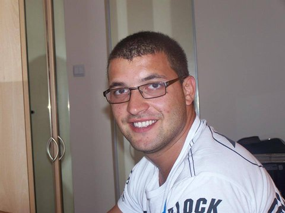

# Списък с менторите за HackFMI 4.

Ако ще пускаш pull request към този списък, ще се радваме, ако включиш информация за:

* Живко Руменов Драганов
* Java(Spring, Hibernate), Ruby on Rails, AngularJS, Linux/Unix
* Senior Software Engineer at TechHuddle
* https://github.com/zdraganov | http://lnkd.in/ahFFct
* В двете връзки по-горе има

[За пример, може да разгледаш списъка с менторите от HackFMI 3](https://github.com/Hackfmi/Organization-Details/blob/master/mentors.md)

## Ментори от Imperia Online

### Тихомир Томов

Executive Producer @Imperia Online

Десет годишен опит в софтуерния девелъпмънт (Java, Perl, PHP, Objective C), опит в проджект и продукт мениджмънта, създаване и юзабилити дизайн на мобилни приложения, ръководене и организация на проекти, ментор в трейнинг кампа на Империя Онлайн.

bg.linkedin.com/in/tihomirtomov

### Божидар „Bave” Грозданов

Senior Game Designer @Imperia Online

Седемнадесет години опит в писане и гейм дизайн (книги-игри, ролеви игри, компютърни игри в множество платформи). Опит в концепцтуализиране на игри, теоретични дизайн методики, гейм механики, левел дизайн, създаване на свят, персонажи и игрови истории. Няколкогодишен опит в преподаването на гейм дизайн методи.

http://bg.linkedin.com/pub/bozhidar-%22bave%22-grozdanov/13/b95/846

### Иван Атанасов

Game Designer @Imperia Online

Дизайнер на игри от 2002 година (а не професионално от 1988). Опит в създаване на игри в различни жанрове, включително Serious games and gamification. Предпочитани жанрове – РПГ и симулации. Автор на ролевата система Аксиом 16. Гейм дизайнер в Империя Онлайн, ментор в трейнинг кампа на Империя Онлайн.

bg.linkedin.com/pub/ivan-atanassov/10/a91/127/

### Полина Атанасова

Junior Game Designer @Imperia Online

Специализира в сферата на предприемачество и активно подпомага за развиването на българската еко система между 2011 - 2014 година. Стои зад третия сезон на предприемаческия турнир 3Challenge като организатор и ментор. Занимава се основно с менторство в сферите на  pitching, product development / placement / management, start-up bizdev.

* Twitter - @PollyPollyna
* http://bg.linkedin.com/pub/pollyna-atanassova/2b/540/4a9

### Христо Петков

Junior Game Designer @Imperia Online

23 годишен опит в играенето на всякакви видове компютърни игри, както на любителско, така и на професионално ниво. Става първият съдия по Magic The Gathering в България. Занимава се с превода, интеграцията и администрацията на Travian за България в продължение на 2 години. Има интереси основно в балансовата/математическа част на гейм дизайна и отскоро се занимава с това професионално в Империя Онлайн

http://bg.linkedin.com/pub/hristo-petkov/31/832/1b4

## Други

### Павел Колев

Software Developer @Telerik

Фен на всички web related технологии, с най - голяма страст към JavaScript. В Телерик работи по платформа за създаване на хибридни мобилни проложения. През свободното си време обича да води лекции, главно в академията на Телерик, както и да изпробва различни настолни игри.

* Twitter - @PavelKolev7
* https://www.linkedin.com/pub/pavel-kolev

### Живко Драганов

Senior Software Engineer @TechHuddle

Професинален опит с web и cloud базираните решения. Agile evangelist. Интерес в системната администрация, управлението на проекти и софтуерно предприемачество. В сферата на игрите предпочитания към алгоритмичните и математически проблеми. В свободното си време обича да играе спортен бридж.

.	

* [LinkedIn](linkedin.com/pub/zhivko-draganov)
