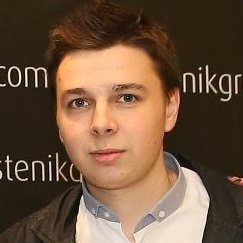
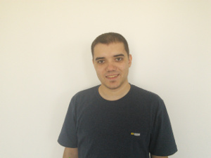
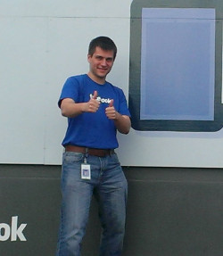

# Списък с менторите за HackFMI 4.

Ако ще пускаш pull request към този списък, ще се радваме, ако включиш информация за:

* Имената
* Описание с опит, технологии и области, в които си добър (няколко параграфа)
* В коя компания работиш
* Социални връзки - Twitter / GitHub
* Някаква връзка към твоя снимка

[За пример, може да разгледаш списъка с менторите от HackFMI 3](https://github.com/Hackfmi/Organization-Details/blob/master/mentors.md)

## Ментори от Imperia Online

### Тихомир Томов

Executive Producer @Imperia Online

Десет годишен опит в софтуерния девелъпмънт (Java, Perl, PHP, Objective C), опит в проджект и продукт мениджмънта, създаване и юзабилити дизайн на мобилни приложения, ръководене и организация на проекти, ментор в трейнинг кампа на Империя Онлайн.

bg.linkedin.com/in/tihomirtomov

### Божидар „Bave” Грозданов

Senior Game Designer @Imperia Online

Седемнадесет години опит в писане и гейм дизайн (книги-игри, ролеви игри, компютърни игри в множество платформи). Опит в концепцтуализиране на игри, теоретични дизайн методики, гейм механики, левел дизайн, създаване на свят, персонажи и игрови истории. Няколкогодишен опит в преподаването на гейм дизайн методи.

http://bg.linkedin.com/pub/bozhidar-%22bave%22-grozdanov/13/b95/846

### Иван Атанасов

Game Designer @Imperia Online

Дизайнер на игри от 2002 година (а не професионално от 1988). Опит в създаване на игри в различни жанрове, включително Serious games and gamification. Предпочитани жанрове – РПГ и симулации. Автор на ролевата система Аксиом 16. Гейм дизайнер в Империя Онлайн, ментор в трейнинг кампа на Империя Онлайн.

bg.linkedin.com/pub/ivan-atanassov/10/a91/127/

### Полина Атанасова

Junior Game Designer @Imperia Online

Специализира в сферата на предприемачество и активно подпомага за развиването на българската еко система между 2011 - 2014 година. Стои зад третия сезон на предприемаческия турнир 3Challenge като организатор и ментор. Занимава се основно с менторство в сферите на  pitching, product development / placement / management, start-up bizdev.

* Twitter - @PollyPollyna
* http://bg.linkedin.com/pub/pollyna-atanassova/2b/540/4a9

### Христо Петков

Junior Game Designer @Imperia Online

23 годишен опит в играенето на всякакви видове компютърни игри, както на любителско, така и на професионално ниво. Става първият съдия по Magic The Gathering в България. Занимава се с превода, интеграцията и администрацията на Travian за България в продължение на 2 години. Има интереси основно в балансовата/математическа част на гейм дизайна и отскоро се занимава с това професионално в Империя Онлайн

http://bg.linkedin.com/pub/hristo-petkov/31/832/1b4

## Ментори от Tech Huddle

### Мирослав Петров

Senior Developer @TechHuddle

4+ години опит в уеб девелъпмънта и в последно време по-насочено към E-commerce. Създател на редица водещи български онлайн магазини.

.

bg.linkedin.com/pub/miroslav-petrov/67/219/a44/

### Живко Драганов

Senior Software Engineer @TechHuddle

Професинален опит с web и cloud базираните решения. Agile evangelist. Интерес в системната администрация, управлението на проекти и софтуерно предприемачество. В сферата на игрите предпочитания към алгоритмичните и математически проблеми. В свободното си време обича да играе спортен бридж.

.

* [LinkedIn](https://linkedin.com/pub/zhivko-draganov)

### Ивайло Блажев

WebGL Developer @Techhuddle

Над 7 години опит в разработката на различни десктоп и уеб платформи с различни технологии Delphi, .NET, JavaScript. Фен на компютърната графика и machine learning algorithms. От скоро се занимава и професионално с графика като WebGL Developer за MapleSoft. През свободното време - бира, ски, планински колела, бордови игри.

* https://www.linkedin.com/pub/ivailo-blazhev/

### Константин Константинов

Senior Web Developer @TechHuddle

Над 7 години професионален опит в разработката на уеб приложения. Специализира в бекенд разработката с PHP. Интересува се от проджект мениджмънт, методологии, процеси и практики за разработка на софтуер. Фен на Agile процесите, TDD, continuous integration.

**Technologies:** PHP, Symfony, Zend Framework, Kohana, Laravel, CodeIgniter, Magento, Wordpress, Web services, ORMs, MySQL, PostreSQL, NoSQL, HTML5, CSS3, Javascript, YUI3, jQuery.

**Beliefs:** Agile, TDD, Continous Integration.

http://bg.linkedin.com/in/konstantinkonstantinov

## Ментори от Musala Soft

### Nikola Bogdanov

Currently making PHD in Sofia University in direction Agile processes, methodologies and project management.

Nikola has been working in Musala Soft for seven year and is in the Software Engineering area for more than 8 year, working with some of the biggest companies in IT.

He is lecturing his own course for Agile Methodologies for master students in Sofia University and participating in different forums and events presenting different topics in the project.

**Technologies:** Java, JEE, Spring, JSF, Struts, Ruby on Rails, Oracle, DB2, MS SQL, Web Services, HTML5, JS3, CSS3, JQuery, AngularJS, Dojo

### Sidney El Agib

Sidney is a highly-motivated professional with diverse multinational experience.

During his career of 4 years of experience in software development and IT, he has specialized in a wide set of different technologies and approaches for handling specific customer needs and critical issues.

Sidney has focus on web-based solutions and has extensive experience in both back-end and front-end. (Thanks to his education he has acquired considerable knowledge in web development, web design, online business and online advertisement.)

Sidney has developed good interpersonal skills, being able to communicate effectively with various kinds of people and customers. He has also been exposed to different working processes and methodologies which has improved his workflow considerably.

A positive person who enjoys working on difficult and challenging tasks as this is a way for personal and professional improvement.

**Social Links:**

* https://plus.google.com/+SidneyKamalElAgibMahmoud/posts
* https://twitter.com/sidneyelagib

**Technologies:** Java, JSP, HTML, CSS, AJAX, Javascript, jQuery, PHP, Ant, MySQL

### Валерия Браянова

Професионaлен опит с web прогрaмирaне (Java, Spring, J2EE, JavaScript, JQuery).

В МусaлaСофт рaботи по бизнес web проекти. Свободно време - бирa, бордови игри, книги.

## Experian

### Александър Телбиз

Business Support Analyst @ Experian

4 години опит в игровата индустрия, главно в насока QA devtester/playtester, работил за Ubisoft (Assassin’s Creed: Liberation), Gameloft (множество заглавия) и Masthead (Earthrise). Интереси има също така към игрови и левъл дизайн, занимава се любителски с правене на игри, 20 години опит в играенето на компютърни и видео игри на любителско и полу-професионално (без основен спонсор). Има също така опит с бордови, ролеви, настолни и книги-игри.

### Александър Ефремов

Senior Business Analyst, Ph.D. @Experian

14 годишен опит в обработката на данни, моделирането, оптимизацията, Калмановата филтрация, числените методи и др. Работил е в петролната индустрия, спътниковата комуникация, пазарния сектор и финансовата индустрия. Основно се занимава с разработване на алгоритми готови за имплементация в реални системи в съответните области.

## Ментори от ChoboLabs

### Румен Златев

**Good at:**

* Game Development
* C++
* Unity3D
* GUI

**Social:**

* LinkedIN: http://bg.linkedin.com/pub/rumen-zlatev/79/362/709

### Петър Добрев

**Good at:**

* Mobile game devеlopment
* Multiplayer
* C++
* HTML5/JS gamedev

**Social:**

* LinkedIN: https://www.linkedin.com/profile/view?id=15420464

## Ментори от Obecto

### Svetlin Arabadjiev

Professional software engineer with more than 10 years of experience, from which 4 years as Studio Manager of Gameloft Bulgaria.

Currently Team Lead and Expert Level Engineer at Obecto - a boutique software development company that has helped many startups implement ideas ranging from time-sensitive video content distribution to operation of hydrothermal carbonization plants.

Svetlin is knowledgeable in many programming languages, software architecture, database design and mobile development.

## Ментори от Facebook

### Marina Moreno

University Strategic Sourcing Specialist

### Alexey Maykov

Software Engineer at Facebook, Seattle office.

**Good at:**

* C++
* Backend infrastructure

### Ivan Ivanov

Software Engineer at Facebook, London office

**Good at:**

* Problem solving
* Open Source Software
* Optimization, algorithms and data structures
* Python, Java, C\C++, Bash, JavaScript, PHP(Hack), Haskell, etc.
* Databases
* Version control systems
* Linux ecosystem, scripting and automation                                     

**Social:**

* Facebook account: https://www.facebook.com/profile.php?id=580159902
* GitHub account: https://github.com/IvanIvanov

### Nedyalko Prisadnikov

Software Engineer at Facebook London
Studied in Sofia University between 2007 and 2011

**Good at:**

* Python
* C++
* Java
* algorithms
* machine learning
* PHP(Hack)

## Ментори от SAP Labs Bulgaria

### Кристиян Маринов

Software Developer / Architect @ SAP

**Good at:**
* Java/EE (+ ecosystem)
* Random things here & there
* Making stuff work

**Social:**
* Twitter - https://twitter.com/kristiyanm
* GitHub - https://github.com/pnt

### Георги Фарашев

Software Developer @ SAP

**Good at:**
* C++
* Java
* Object-oriented design

**Additional knowledge:**
* JavaScript
* Python
* Git
* Agile methodologies

**Social:**
* LinkedIn - bg.linkedin.com/pub/georgi-farashev/a6/56a/942/

## Други

### Павел Колев

Software Developer @Telerik

Фен на всички web related технологии, с най - голяма страст към JavaScript. В Телерик работи по платформа за създаване на хибридни мобилни проложения. През свободното си време обича да води лекции, главно в академията на Телерик, както и да изпробва различни настолни игри.

* Twitter - @PavelKolev7
* https://www.linkedin.com/pub/pavel-kolev
